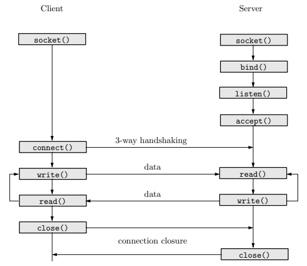
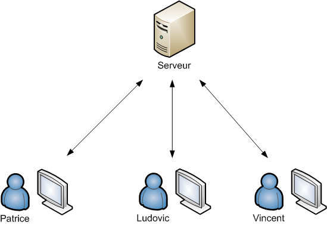

# FT_IRC
      
## Sommaire
- [Introduction](#Introduction)
- [Notions de bases](#Notions-de-bases)
    - [serveur IRC](#+-SERVEUR-IRC)
    - [client IRC](#CLIENT-IRC)
    - [procole TCP/IP](#PROTOCOLE-TCP/IP)
    - [sockets](#SOCKETS)
- [Plan du projet](#Plan-du-projet)
    - [Creation du serveur](#Creation-du-serveur)
    - [ Implementation des commandes](#Implementation-des-commandes)
- [Notes](#Notes)
- [Ressources](#Ressources)
       
## Introduction
      
>On va creer notre propre serveur irc (Internet Relay Chat) en suivant le [protocole irc](https://datatracker.ietf.org/doc/html/rfc2812). 
>Ce protocole sera implemente grace a un systeme utilisant le protocole TCP/IP. 
       
## Notions de bases
+ SERVEUR IRC
     - Concretement, un serveur IRC est un systeme de communication textuel via le reseau. Utilisant le modele serveur-client, ce protocole permet de l'adapter a de nombreuses plateformes comme messenger, twitter ou ~~MSN~~. 
     - Le serveur c'est le point central du systeme IRC, il fournit un point auquel les clients peuvent se connecter pour parler et permettre la connexion entre serveurs (partie qu'on ne doit pas implementer dans notre ft_irc)
     
+ CLIENT IRC
    - Un client IRC est tout simplement un element qui se connecte au serveur IRC qui n'est pas un serveur. TADAM :tada: 
    - Les clients se distinguent entre eux grace a un surnom qu'il est d'usage d'entrer des son entree dans le serveur ainsi que son username.  

+ PROTOCOLE TCP/IP
    - Le protocole TCP/IP (Transmission Control Protocol) permet de gérer les données en provenance (ou à destination) de la couche inférieure du modèle (c'est-à-dire le protocole IP). TCP est un protocole orienté connexion, c'est-à-dire qu'il permet à deux machines qui communiquent de contrôler l'état de la transmission.
    - Lors d'une communication à travers ce protocole, les deux machines doivent établir une connexion. La machine émettrice est appelée client, tandis que la machine réceptrice est appelée serveur. On dit qu'on est alors dans un environnement Client-Serveur.
    - Le protocole TCP/IP et le protocole IRC sont indissociables. Notre cher [arthur](https://github.com/arthur-trt) vous propose donc une comparaison plutot parlante : 
                → le protocole TCP est a considere comme la maniere de communiquer (ex: une lettre) tandis que le protocole IRC est la maniere de transmettre l'information (ex: dans la langue francaise). On ne peut donc pas obtenir tous les resultats attendus si on utilise pas les deux outils ensembles. 
    - Concretement, on va pas reimplementer le protocole TCP mais simplement l'utiliser. 

+ SOCKETS 
    -  Il s'agit d'un modele permettant la communication notamment a travers un réseau TCP/IP.
    -   Une fois qu'une connexion est établie, un fichier socket est utilisé pour identifier de façon unique la connexion.
    -   Une nouvelle petite analogie pour comprendre l'interet des sockets → la communication par sockets est souvent comparee aux communications humaines. On en distingue 2 types :
        * le mode connecte (ex : communication telephonique) utilisant le protocole TCP. La connexion durable etablie entre les deux processus permet de ne pas necessairement avoir besoin de l'adresse de destination a chaque envoi de donnees.
        * le mode non connecte (ex: communication par courrier) utilisant le protocole UDP. Ce dernier necessite l'adresse de destination a chaque envoi et il n'y a pas d'accuse de reception de celle ci. 

+ FONCTIONS

| Fonctions                      | Description                                                            | 
| -------------------------------|------------------------------------------------------------------------|
 **socket()**                    | cree un endpoint pour la communication et return un descriptor.        | 
 **setsockopt()**                | manipulent les options pour la socket.                                 |
 **getsockname()**               |  renvoie l'adresse actuelle a laquelle la socket est lie.              |
 **getprotobyname()**            | lit l'entree suivante depuis la base de donnees du protocole.          |
 **gethostbyname()**             |  obsolete                                                              |
 **getaddrinfo()**               | retourne une ou plus de structures dans laquelle contient l'adresse internet avec laquelle on peut utiliser bind ou connect. |
 **freeaddrinfo()**              |  free the memory                                                       |
 **bind()**                      | pour donner un nom assigne a la creation d'une socket, affecte l'adresse spécifiée dans addr à la socket référencée par le descripteur de fichier sockfd. Traditionnellement cette opération est appelée « affectation d'un nom à une socket ».|
 **connect()**                   | connecte la socket referencee par le descriptor sockfd indiquee par serv_addr.  |
 **listen()**                    |  marque la socket referencee par sockfd comme une socket passive, c'est-a-dire comme une socket qui sera utilisee pour accepter les demandes de connexions entrantes en utilisant accept. |
 **accept()**                    | utilise avec les sockets utilisant un protocole en mode connecte; extrait la première connexion de la file des connexions en attente de la socket sockfd à l'écoute, crée une nouvelle socket connectée, et renvoie un nouveau descripteur de fichier qui fait référence à cette socket. La nouvelle socket n'est pas en état d'écoute. La socket originale sockfd n'est pas modifiée par l'appel système. |
 **htons()**                     |  convertit un entier court non signé hostshort depuis l'ordre des octets de l'hôte vers celui du réseau. |
 **htonl()**                     | convertit un entier non signé hostlong depuis l'ordre des octets de l'hôte vers celui du réseau.    |  
 **ntohs()**                     | convertit un entier court non signé netshort depuis l'ordre des octets du réseau vers celui de l'hôte. |
 **ntohl()**                     | convertit un entier non signé netlong depuis l'ordre des octets du réseau vers celui de l'hôte. |
 **inet_addr()**                 | convertit l'adresse Internet de l'hôte cp depuis la notation IPv4 décimale pointée vers une forme binaire (dans l'ordre d'octet du réseau), et la stocke dans la structure pointée par inp. inet_aton() renvoie une valeur non nulle si l'adresse est valide, et zéro sinon. |
 **inet_ntoa()**                 | convertit l'adresse Internet de l'hôte in donne dans l'ordre des octets du réseau en une chaîne de caractères dans la notation numérique pointée. La chaîne est renvoyée dans un tampon alloué statiquement, qui est donc écrasé à chaque appel. |       
 **send()**                      | permet de transmettre un message à destination d'une autre socket.     |
 **recv()**                      |  utilisé pour recevoir des messages depuis une socket.                |
 **signal()**                    | installe le gestionnaire handler pour le signal signum.               |
 **lseek()**                     | place la tête de lecture/écriture à la position offset dans le fichier ouvert associé au descripteur fd en suivant la directive whence. |
 **fstat()**                     | recupere les informations d'un fichier.                                 |
 **fcntl()**                     | permet de se livrer à l'une des opérations décrites plus loin sur le descripteur de fichier. |
 **poll (ou équivalent)**        |  variation de select, attend que l'un des descripteurs de fichiers parmi un ensemble soit pret pour effectuer des entrees-sorties. |
 
## Plan du projet 

### Creation d'un serveur de base

### Implementation des commandes

## Notes

## Ressources
- [un super cool site fait par des etudiants de 42](https://ircgod.com/)
- [encore et toujours un super readme de notre Claire nationale](https://github.com/Ccommiss/ft_irc/blob/main/README.md)
- [l'ancienne RFC du protocole IRC](https://datatracker.ietf.org/doc/html/rfc1459#section-1)
- [Un RFC plus recent](https://datatracker.ietf.org/doc/html/rfc2812)
- [un memo des commandes irc](https://fr.wikipedia.org/wiki/Aide:IRC/commandes)
- [un tres bon resume pas a pas du protocole IRC](http://www.lsv.fr/~rodrigue/teach/npp/2012/tp1.pdf)
- [un tuto d'implementation d'un serveur IRC en python](https://www.youtube.com/watch?v=3QiPPX-KeSc)
- [pour comprendre comment utiliser concretement un serveur IRC](https://bioinfo-fr.net/irc-mais-cest-quoi-en-fait)
- 
